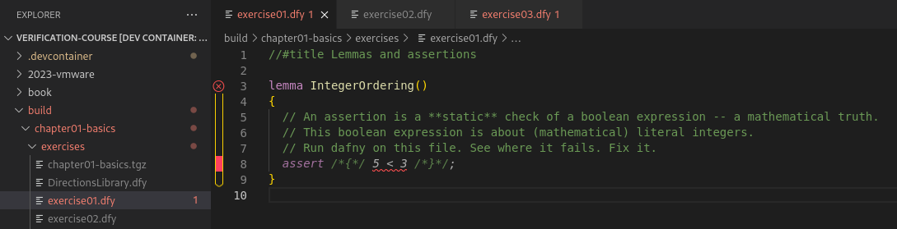

# Protocol Verification

These are the course exercises for the VMware 2023 Protocol Verification course.

## Setting up VS Code development environment

We provide a "dev container" which packages both software and IDE configuration
to work on the exercises. This setup is based on a Docker container running
Ubuntu, which is where you'll be running Dafny.

### Install VS Code and Docker

**VS Code** Follow the instructions for your platform at
https://code.visualstudio.com/docs/setup/setup-overview.

**Docker** Follow the instructions at https://docs.docker.com/get-docker/. We
recommend using Docker Desktop on Windows and macOS. On Linux you can instead
choose to install Docker Engine (see https://docs.docker.com/engine/).

### Install Dev Containers extension into VS Code

Install the Dev Containers extension. If you have the `code` command line
utility, run `code --install-extension ms-vscode-remote.remote-containers`.
Alternately, from within VS Code, hit <kbd>Ctrl</kbd>+<kbd>p</kbd>
(<kbd>Cmd</kbd>+<kbd>p</kbd> on macOS) and then type `ext install
ms-vscode-remote.remote-containers`.

### Open the workspace

Open the folder:

* From inside VS Code, use File→Open Folder and select this repo's cloned folder.
* Alternately, from your command-line, change directory to the course directory and type `code .`.

You should get a prompt to re-open inside the container:

  

Click `Reopen in Container.`
If you don't get the
prompt, you can also run "Dev Containers: Reopen in Container" using
<kbd>Ctrl</kbd>+<kbd>Shift</kbd>+<kbd>p</kbd> (<kbd>Cmd</kbd>+<kbd>Shift</kbd>+<kbd>p</kbd> on macOS).

It may take a while on first start to download and set up the Docker container.

### Try Dafny

Use the file tree to open `chapter01-basics/exercise01.dfy`.
When the Dafny extension has fully loaded, the file will be
syntax-colored and the failing assert will have a red squiggly underline.

  

Work through the exercises in the chapter as assigned.

### Open a shell terminal inside VS Code

Use <kbd>Ctrl</kbd>+<kbd>Shift</kbd>+<kbd>p</kbd>
(<kbd>Cmd</kbd>+<kbd>Shift</kbd>+<kbd>p</kbd> on macOS) to search for "Terminal:
Create New Terminal" to get a terminal running within the dev container.

You can use the terminal to run `dafny verify` on the command line.

### Package your work for submission.

From the terminal, type these commands to create a tarball of your current work
on chapter01:
```
cd chapter01-basics/
../tools/package.py
```
Follow the course instructions to submit the tarball.
